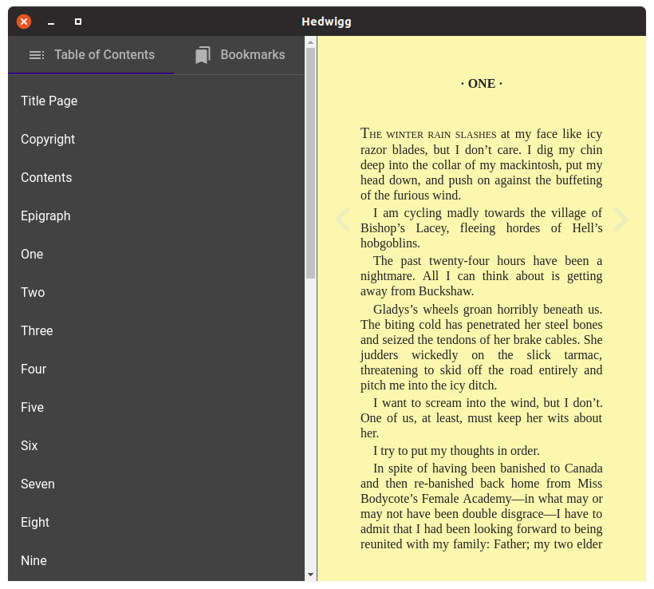
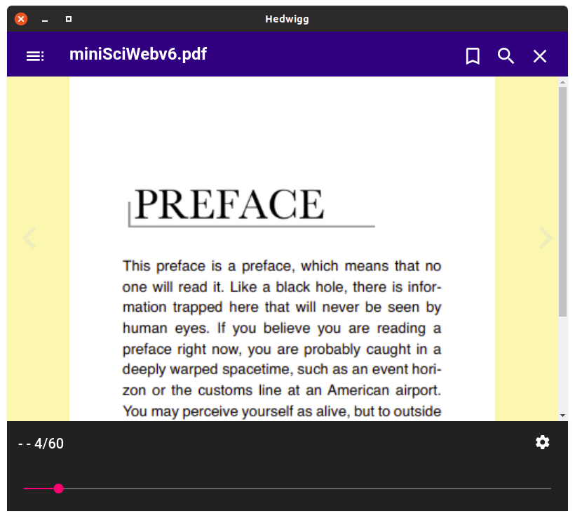
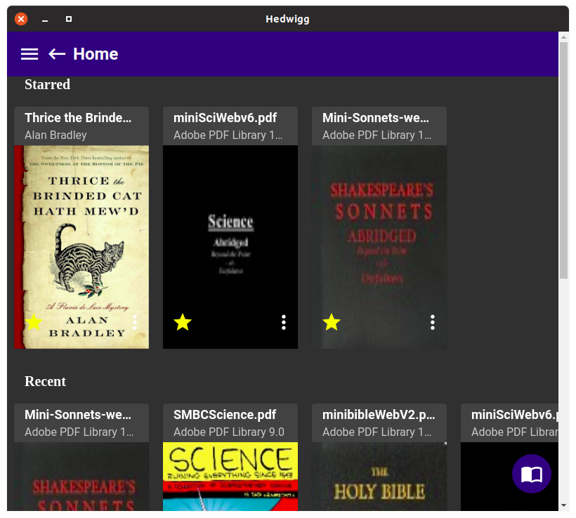
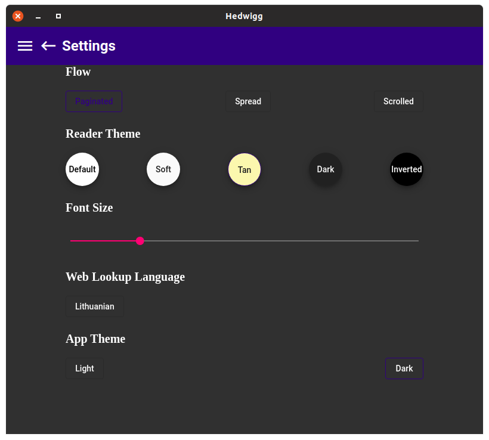
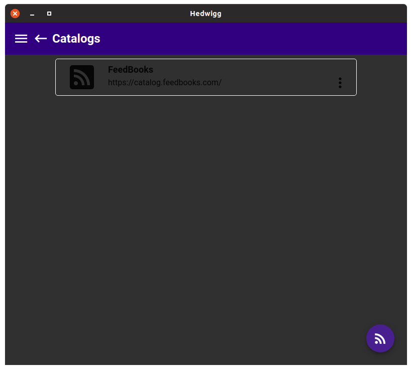
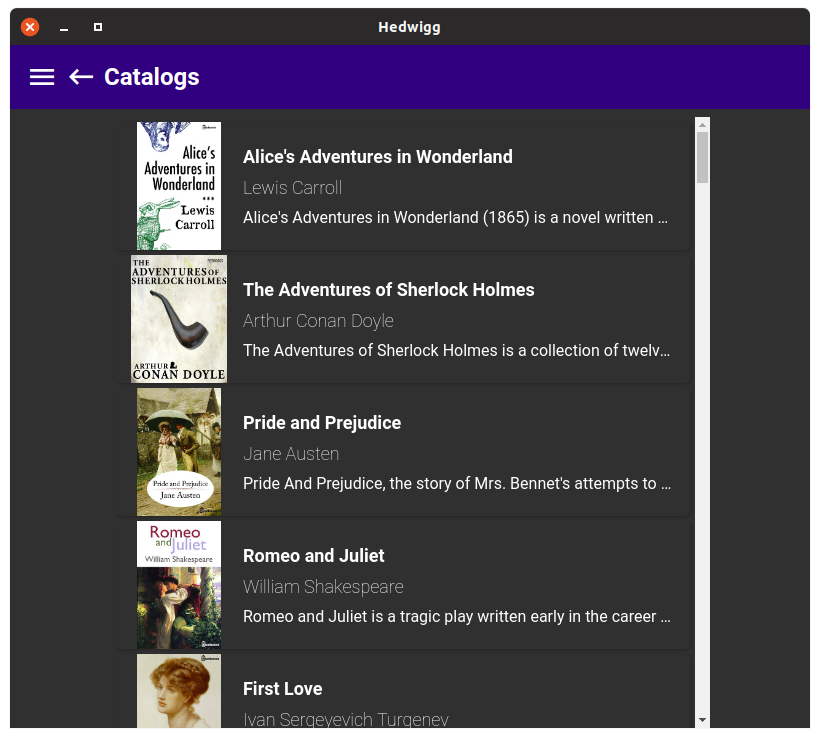

# Hedwigg

This is a simple, yet elegant ebook reader.

The primary intention behind this project is reading books that are not in
your native tongue.
As such Hedwigg includes web lookups for Wikipedia, Wiktionary and Google Translate.

While Hedwigg includes basic library management functions, it's only meant to manage books you
download from OPDS catalogs, such as FeedBooks or personal library served with Calibre server.

Hedwigg is in active development, as such there may be bugs and new features are in the works.

You know what they say, a picture speaks a thousand words, so here are some screenshots.

## Acknowledgments

Hedwigg is powered by [epub.js](http://futurepress.org/) and [pdf.js](https://mozilla.github.io/pdf.js/)
